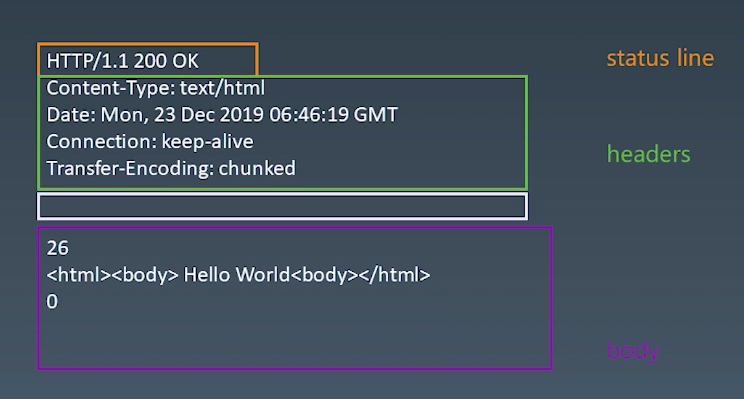

# 浏览器工作原理 学习笔记

## 总论

## HTTP请求 - send 函数的编写，了解 response 格式

`response`格式 

- 任何的特殊字符都不能分隔 response 的 `body`部分

### HTTP请求 - 发送请求

发送请求的异步函数的设计

- 设计支持已有的`connection`或者自己新建的`connection`

- 收到数据，传给`parser`

- 根据`parser`的状态 `resolve Promise`

### HTTP请求 - response 解析

